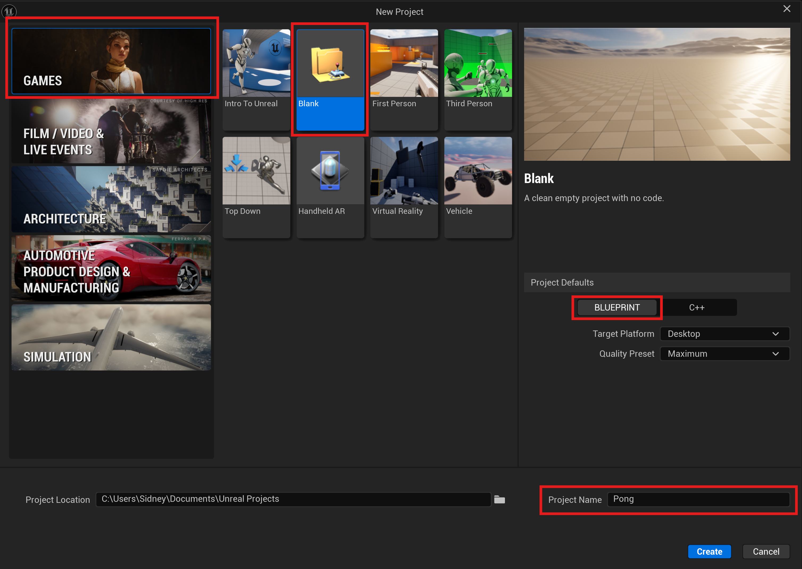

# Project Setup

## Start Unreal Engine
- Open the Epic Games Launcher and select Unreal Engine from the list on the left
- Click either the Launch button in the top-right corner or under the Library tab.

## Create a New Project
1. Click **"New Project"**

2. Select **"Games"** category
3. Choose **"Blank"** template
4. **Project Defaults:**
    - Blueprint (not C++)
    - Target Platform: Desktop
    - Quality Preset: Maximum
5. Name your project "Pong"
6. Click **"Create"**

Wait for the project to load. You'll see the main Unreal Editor with a default level.

---
>Next: [What Makes Pong, Pong?](/02_What/WHAT.md)