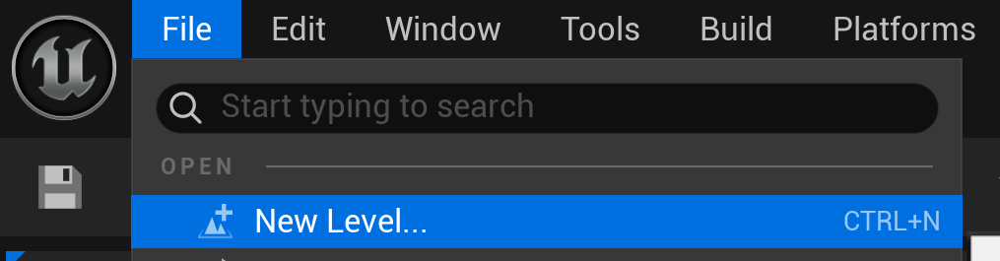
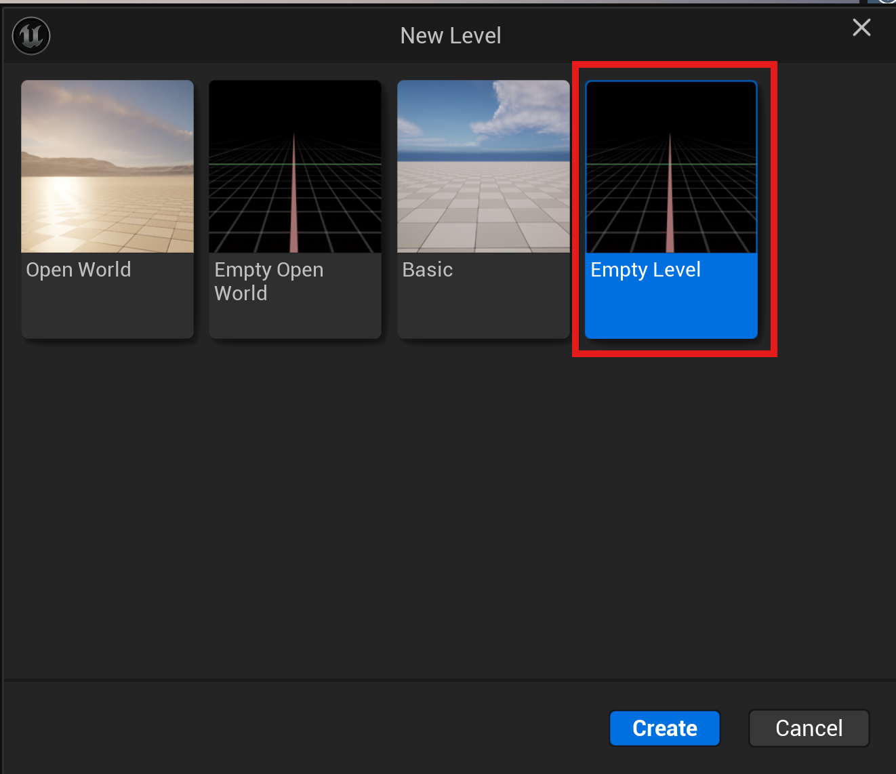
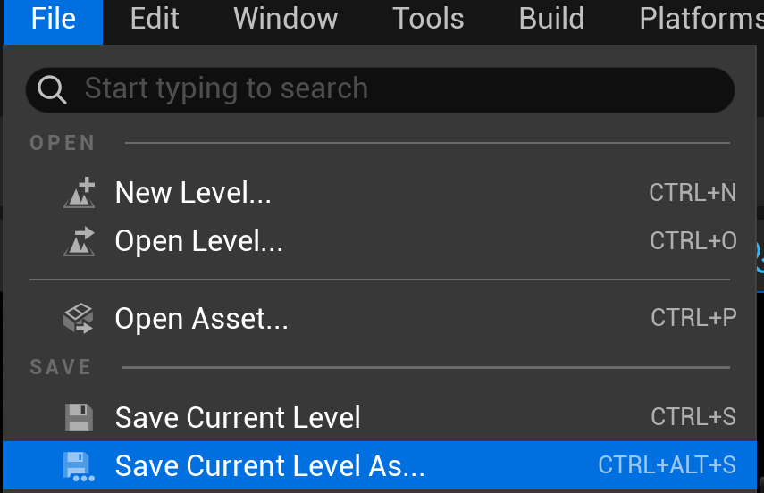
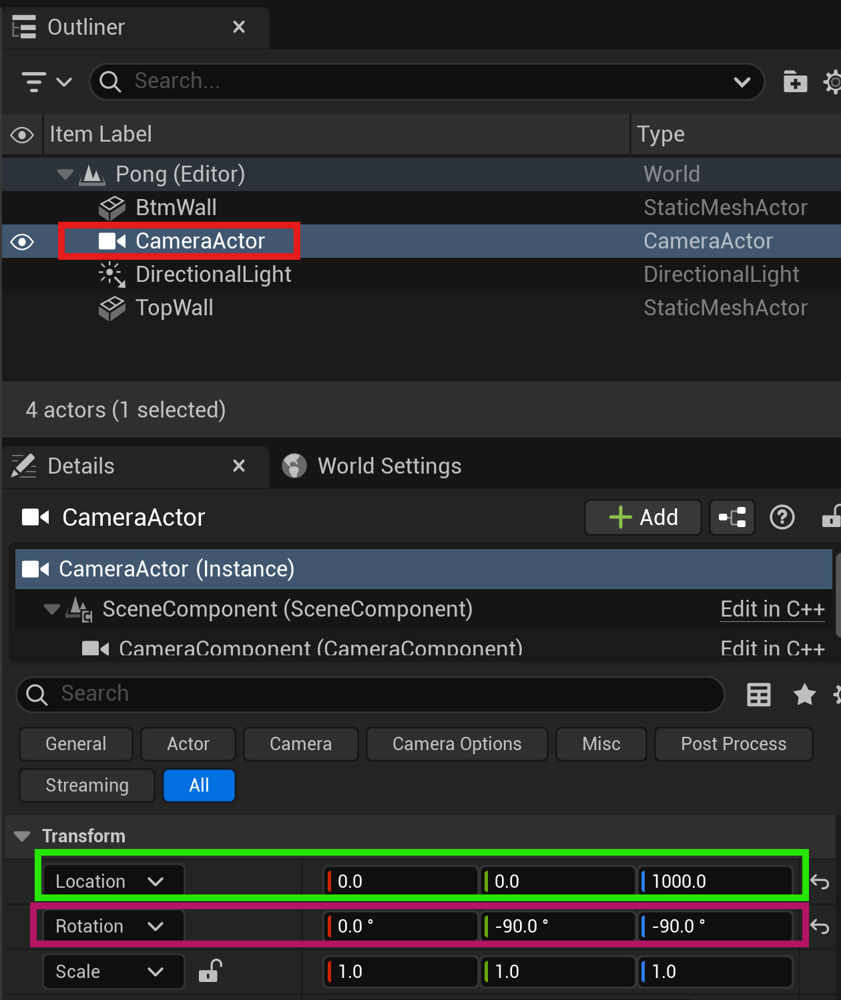

# Creating the Game Area

## Create A New Level (Map)
1. In the top-left, Click File → New Level

2. Then select the Empty Level and click Create

## Create A New Folder
1. Click on the Content Drawer button in the lower-left.

2. Click either the Add button or right-click within the content drawer, and from the menu select New Folder.

3. Name that folder Maps

## Save The Level
1. File → Save Current Level As
2. Select the Maps folder as the location
3. Name the level Pong

## Set Up A Light and Camera

1. To add the main light, click **"Quick Add"** (top left) → **Lights** → **Directional Light**
2. For the camera, click **"Quick Add"** → type and select **Camera Actor** in the search box 

3. Select the camera in the Outliner
4. In the **Details** panel (right side), set:
    - **Location:** X=0, Y=0, Z=1000
    - **Rotation:** X=0, Y=-90 (camera looking down), Z=-90 (This will make our X,Y coordinates more closely match a 2D screen coordinate system)

5. Under Camera Settings
    - Change Projection Mode to Orthographic
    - Ortho Width to 1900

6. Choose **"Player 0"** under Auto Player Activation

## Create the Play Field Boundaries
We'll create walls to keep the ball in play.

**Top Wall:**
1. Click **"Quick Add"** → **Shapes** → **Cube**
2. Rename it to "TopWall" (press F2 or right-click → Rename)
3. In the Details panel:
    - **Location:** X=0, Y=-550, Z=0
    - **Scale:** X=20, Y=0.5, Z=2

**Bottom Wall:**
1. Duplicate the TopWall (select it and press Ctrl+D)
2. Rename to "BtmWall"
3. Set **Location:** X=0, Y= 550, Z=0

## Check the Camera View
Click on the Camera Actor in the outliner. The camera preview should look like this:

---
>Prev: [What Makes A Game?](/02_What/WHAT.md) |  Next: [Creating the Paddles](/04_Paddle/PADDLE.md)