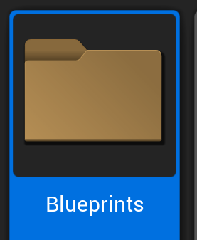
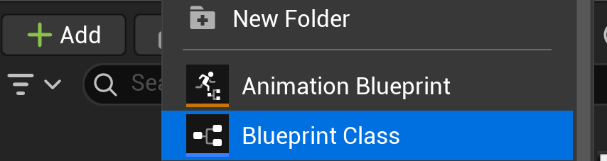
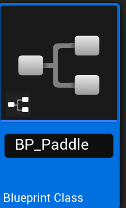

# Creating the Paddles

First let's create a new folder to contain our Blueprints.
Name it Blueprints.

## Create A BluePrint
1. Inside the folder, Click **"Add"** → **Blueprint Class**

2. Select **Pawn** as the parent class

3. Name it "BP_Paddle"

4. Double-click BP_Paddle to open the Blueprint Editor

### Inside the Blueprint:
1. In the **Components** panel (top-left), you'll see "DefaultSceneRoot"
2. Click **"Add"** → **Cube**

3. Select the Cube component, then in Details:
    - **Scale:** X=0.5, Y=3, Z=2
4. Set **Collision Presets** to "OverlapAll"

    

**Add a Variable for Paddle Speed:**
1. In the **My Blueprint** panel (left side), find **Variables** section
2. Click the **"+"** button

3. Name it "MoveSpeed"
4. Click the variable, in Details set:
    - **Variable Type:** Float

   
   
5. Click Compile at the top so that we can set a default value for MoveSpeed
   
    
- **Default Value:** 500.0 (compile first by clicking "Compile" at the top)
   
    
 
6. Make MoveSpeed **"Instance Editable"** by checking the property or the eye icon.

7. **Compile** and **Save** the Blueprint

## Place Paddles in the Level
1. Drag **BP_Paddle** from the Content Browser into the viewport
2. Position it:
    - **Location:** X=-900, Y=0, Z=0
3. Rename this instance to "PlayerPaddle" in the Outliner
4. Duplicate it (Ctrl+D)
5. Position the duplicate:
    - **Location:** X=900, Y=0, Z=0
6. Rename to "AIPaddle"

If you select the Camera Actor in the Outliner, the camera preview should look like this:

---
>Prev: [Creating the Game Area](/03_Area/AREA.md) |  Next: [Player Input](/05_Input/INPUT.md)