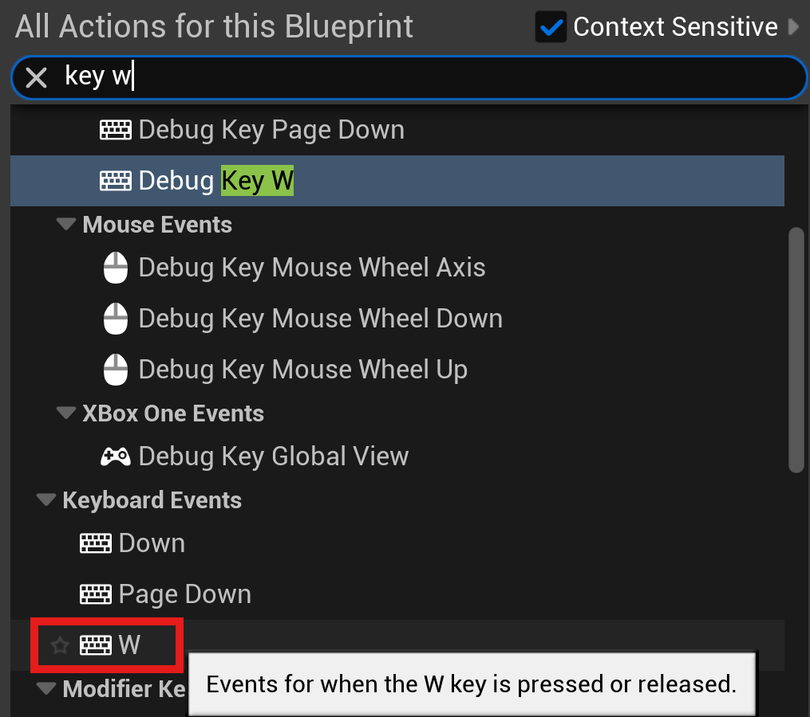
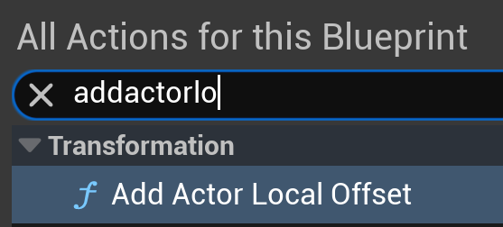
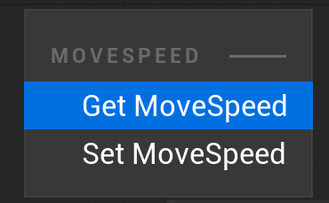
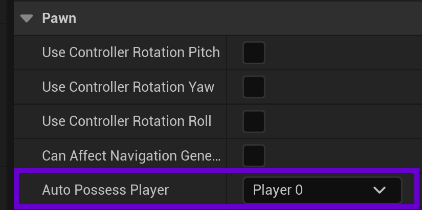
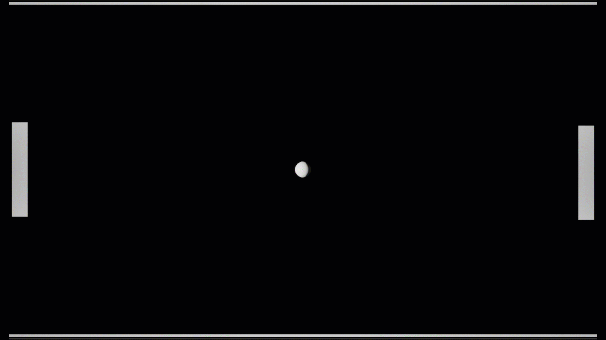
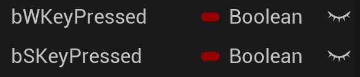
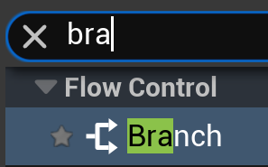

# Setting Up Player Input

>[!NOTE]
> This isn't the recommended method for handling input, which will be covered later.

## Add Movement Logic to Paddle
1. Open **BP_Paddle** Blueprint
2. Click on **Event Graph** tab (top center)

3. Right-click in the graph and type "key w"
4. From the list, under Keyboard Events, choose W (with the keyboard icon)

5. Now do the same for the S key.

You should have two keyboard events for the keys "S" and "W" added to the EventGraph:

### Create Movement Logic
1. Right-click and search for "AddActorLocalOffset"

2. Drag and drop **MoveSpeed** from the Variables panel into the graph. From the context menu, choose "Get MoveSpeed"

3. AddActorLocalOffset is doing some work for us. Basically, it's adding a vector (Delta Location) to the current actor's (in this case our paddle) location, which is also a vector. 
   * We only want to move the paddle in one direction (the Y axis) when pressing the W key.
   * A vector is made up of three float values for each axis. We can split Delta Location in order to affect only the axis we want.
   * Right-click on Delta location and choose Split Struct Pin
   

   

4. Now we want to drag the value of MoveSpeed into the value for DeltaLocationY. We also want to connect the W Pressed action into AddActorLocalOffset:

5. To be able to test this out, we need to select the root of our BluePrint in the Components tab, which is BP_Paddle (Self).
   * Then in the Details panel on the right, we want to set Auto Possess Player to Player 0
   
   

6. **Compile** and **Save** the blueprint.

## Test it Out

1. Back at the level, if you click on the green play button in the center, you can play your game as it currently exists.
2. Click on the viewport, you should see your mouse cursor disappear, and press the W key on your keyboard.

You should see something like this:

>[!NOTE]
> If the right-hand side paddle (AIPaddle) is moving instead of the left, you need to click on AIPaddle in the outliner, and change **Auto Possess Player** to **Disabled**

So there are a few issues:
1. The paddle is moving in the wrong direction
2. We have to press the 'W' key each time to make the paddle move rather than just holding it down.
3. The paddle moves a large distance each time.

## Let's Fix the Input

What we want to do is combine our key events for S and W with our Paddle's Tick event. Since these are separate events, we need a way to communicate inside Tick whether our keys are pressed or not.
Whenever we want to keep track of a value that's essentially On or Off, True or False, we use the boolean variable type.

Create two new Boolean variables named bWKeyPressed and bSKeyPressed. 

1. Drag and drop both booleans to the EventGraph, and choose to **Set** each variable.
2. Copy and paste each so that you have two sets of each variable.
3. Now we want to connect the key events for Pressed and Released to the associated boolean
4. We'll make the boolean True (by checking it) when the key is pressed.

It should look like this when complete:

### Moving to Tick

From Tick the first thing we'll do is check if the W key is pressed or not and act accordingly. To do this we need a Branch node. Right-click, search for and add Branch.

Branch allows us to change what happens based on a True or False evaluation. This is where the booleans come in.

Setting it up like the image above, each frame we're checking if the W key is currently pressed or not. If it is pressed (True) then we want to move the paddle. This is where we can bring back the movement logic:

This allows us to keep the W key held down and the paddle moving.

### Moving the Opposite Direction and Smoothing Things Out

To get the paddle to move the correct direction when pressing the W key, we need to negate the value of MoveSpeed. We can easily do this by using the **Multiply** operator and multiplying by a value of **-1**.

Now to smooth things out and make it so that our paddle doesn't jump in large increments, we want make use of Delta Seconds that's part of the Tick event. Delta Seconds provides a more consistent value when dealing with an event that takes place every frame. To make use of it, we'll click on the '+' button on the Multiply node to add another pin. Then attach Delta Seconds to that pin.

>[!TIP]
> You can double-click on node wires to add a point to the wire to increase legibility

That takes care of the W key. Now if the W key isn't pressed (False), we want to check to see if the S key is pressed. We'll be doing the same thing for the S key, except for multiplying by -1. Because we want the paddle to move down when S is pressed. It should look like this when complete (I've moved things for legibility):

>[!TIP]
> You can marquee select nodes and then press the 'C' key to add a comment box.

### Now if you compile, save, and play the game, it should be a smoother experience

---
>Prev: [Creating the Paddles](/04_Paddle/PADDLE.md) |  Next: [Creating the Ball](/06_Ball/BALL.md)