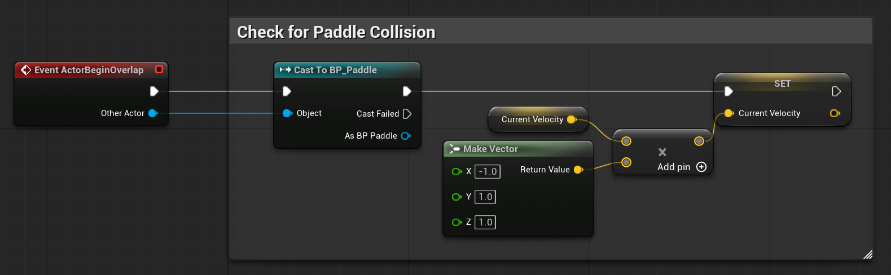
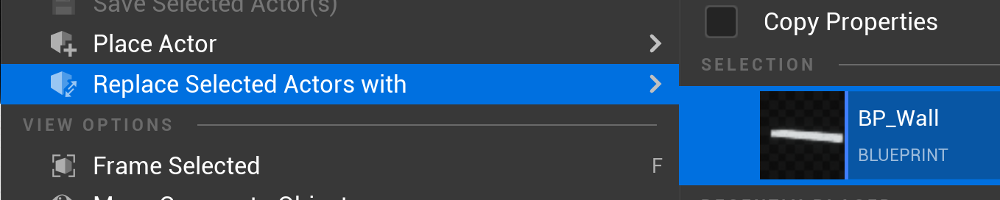

# Adding Collision Detection

## Ball Collision with Paddles
1. Open **BP_Ball** Blueprint
2. In **Event Graph**, right-click and search for "Event ActorBeginOverlap"
3. This creates an overlap event node

**Bounce Logic:**
1. From the **Other Actor** pin, drag and search for "Cast to BP_Paddle"
    - This checks if we hit a paddle
2. From the **Cast Success** pin (top execution pin), create the bounce:
    - Get **Current Velocity**
    - Use a **Multiply** node and set to -1.0 on the X component
    - Set the result back to **Current Velocity**

## Ball Collision with Walls
In order to do the same with the walls, we need to turn them into a class (BluePrint) that we can cast to.

1. Create and open a new BluePrint named **BP_Wall**
2. Click **"Add"** → **Cube**
3. In the Details panel:
    - **Scale:** X=20, Y=0.5, Z=2
4. Compile and Save

## Replace the Cubes with BP_Wall
1. In the level or Outliner, right-click on TopWall.
2. From the context menu choose **Replace Selected Actors With** → **BP_Wall**

3. Do the same for BtmWall
4. You'll need to reset the scale (1,1,1) on the walls if you want them to look as they did before.

## Add Collision Logic for the Walls
If the ball didn't overlap with a paddle (Cast Failed), let's check to see if it overlapped with a wall.
The logic will be the same as the paddles, but -1 in Y rather than X.

---
>Prev: [Creating the Ball](/06_Ball/BALL.md) |  Next: [Score System](/08_Score/SCORE.md)