# Creating the Score System

## Create A Game Mode Blueprint
1. **Create** → **Blueprint Class** → **Game Mode Base**

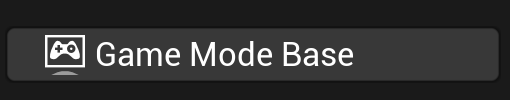

2. Name it "BP_PongGameMode"
3. Open it

**Add Score Variables:**
1. Add variable "Player1Score" (Integer) = 0
2. Add variable "Player2Score" (Integer) = 0
3. Add variable "MaxScore" (Integer) = 5

**Add Score Functions:**
1. In **Functions** section (My Blueprint panel), click **"+"**
2. Name it "AddPointPlayer1"

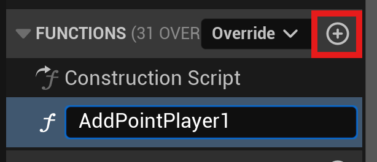

3. In the function graph:
    - Get **Player1Score**
    - Add **Increment** node (or add 1)
    - Set **Player1Score** with the new value

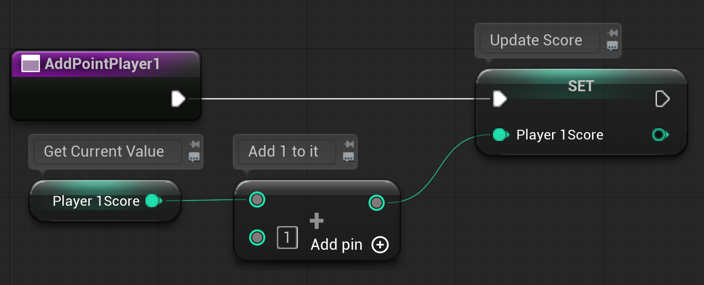

4. Create similar function "AddPointPlayer2"

**Set as Default Game Mode for the Level:**
1. From the level, go to **Window** → **World Settings**

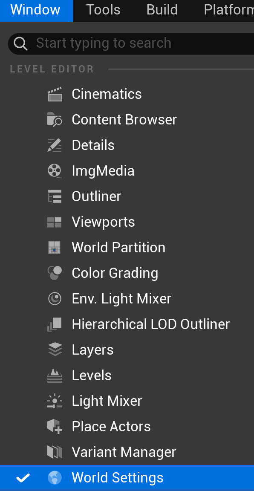

2. You should see a new World Settings tab beside Details on the right.
3. Select BP_PongGameMode from the dropdown for GameMode Override

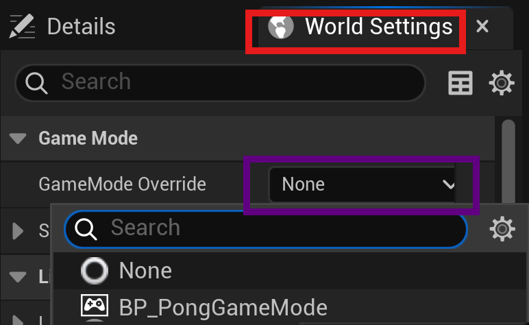

## Adding Points

In order to add points, we're going to use the ball's location to determine if it has passed either paddle.

1. In BP_Ball's EventGraph, right-click in an empty space, search for custom event, and click on Add Custom Event

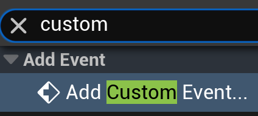

2. Name the custom event CheckForScore
3. Now back at the Tick event, let's call our custom event by adding it to the end. You can right-click and search for CheckForScore to add it.

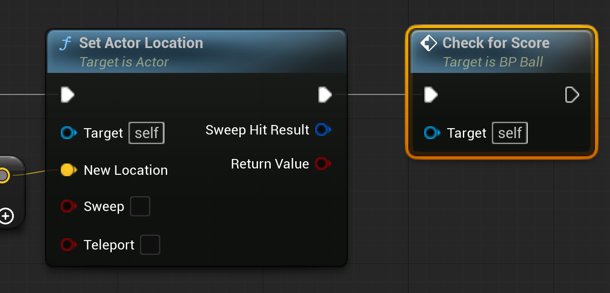

### CheckForScore

1. We want to get the ball's current location
2. Check if the ball's X location is less than -1100 (left-side). If it is, Player 2 scored.
3. If not, we need to check if the ball's X location is greater than 1100 (right-side). If so, Player 1 scored.

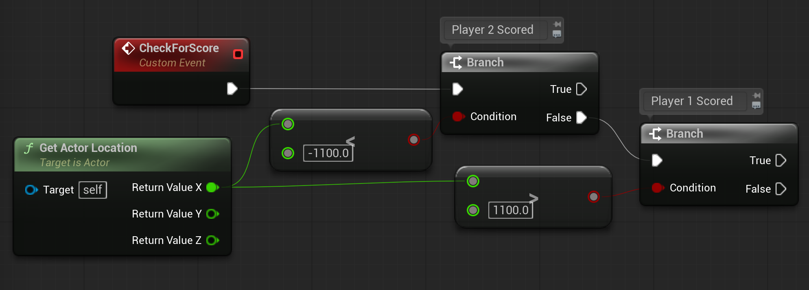

If either branch is true, we want to use the function we made in our game mode to update the associated score.

### Adding a Point for Player 2
1. First, we need to get the current game mode. You can do this by using the Get Game Mode node.
2. Then we need to make sure the current game mode is the one we want by casting to it. Drag off the Return Value and search for "Cast BP" and you should see the game mode.

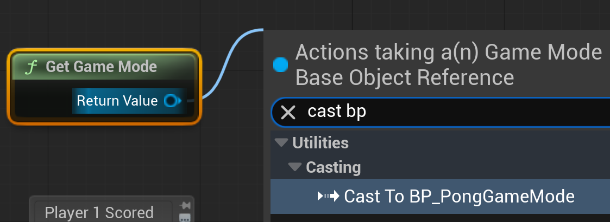

3. Now we can access our function by dragging off of "As BP Pong Game Mode" and searching for AddPlayer2

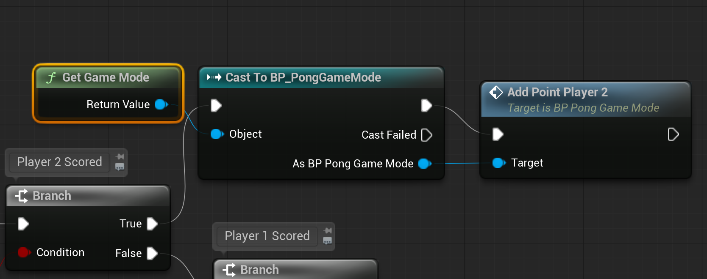

4. Finally, we want to do the same for Player 1.

## Test and Debug
1. To test this out, we need a visual that something happened. In each function for adding a point, let's add a Print String node and connect the updated score.

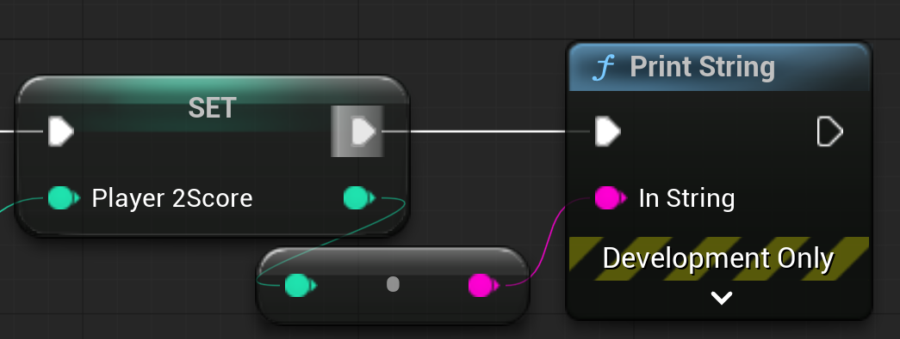

2. If you test it out, you'll see that it works, but the score will add one infinitely. 

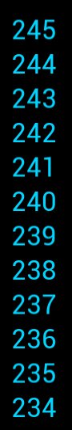

The issue is that the ball still exists, its tick event is still running, and the condition is true for adding the point.

## Destroy and Respawn the Ball
1. In the ball blueprint, after a point is added, let's add a DestroyActor node. This will do what it says.

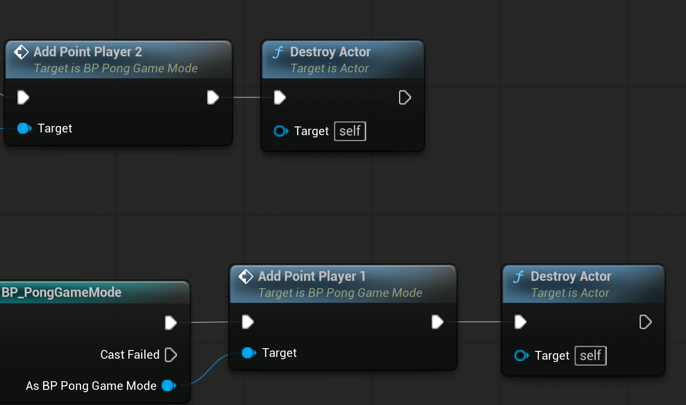

2. In the game mode, let's create a new function named RespawnBall
3. Search for the Node Spawn Actor From Class
4. In the class dropdown, choose BP_Ball
5. Drag off of Spawn Transform, and search for Make Transform. You can leave the default values.

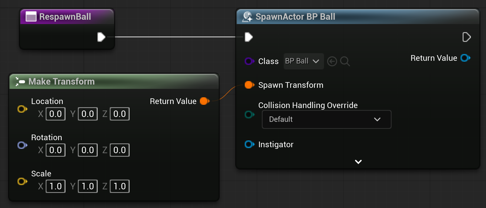

6. You can now replace the PrintString nodes with RespawnBall after a point has been added.

## Test it Out and the Ball Should Respawn

---
>Prev: [Collision Detection](/07_Collision/COLLISION.md) |  Next: [Creating the UI](/09_UI/UI.md)