# Creating the UI (HUD)

## Create a Widget Blueprint
1. Create a new folder named UMG
2. Right-click in Content Browser → **User Interface** → **Widget Blueprint**

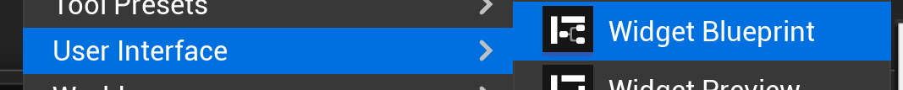

3. Choose the only option "User Widget"
4. Name it "WBP_PongUI"
5. Double-click to open the **UMG Designer**

**Design the HUD:**
1. From the **Palette** panel (left), search and drag a **Safe Zone** to the Hierarchy
2. Add a **Canvas Panel** to the Safe Zone

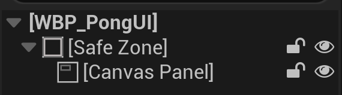

3. Drag two **Text** blocks onto the Canvas Panel
4. Select first Text:
    - Rename to "TxtPlayer1Score"
    - Check **Is Variable**
    - In Details:
        - **Position X:** 200, **Position Y:** 50
        - **Size To Content** (Checked)
        - **Text:** "0"
        - **Font Size:** 72
        - **Justification:** Center
      
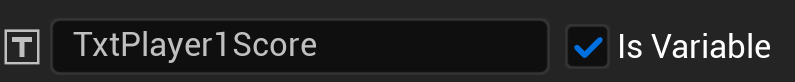
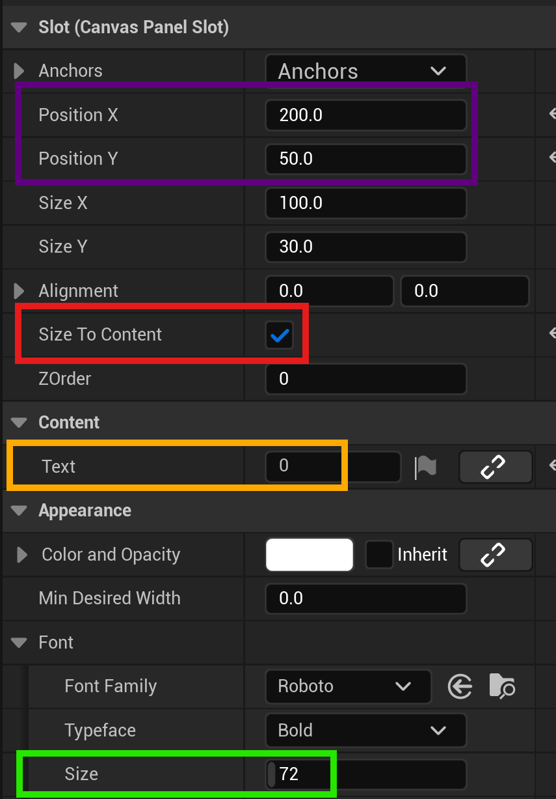
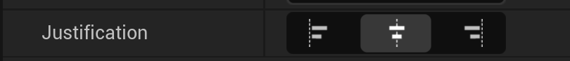

5. Select second Text:
    - Rename to "Player2ScoreText"
    - Check **Is Variable**
    - **Position X:** 1720, **Position Y:** 50
    - **Text:** "0"
    - **Font Size:** 72

**Add Center Line:**
1. Drag an **Image** widget to the canvas
2. Set size: x = 5, y = 1080
3. From the Anchor dropdown, choose the center option

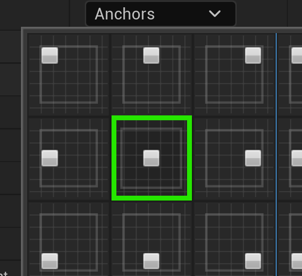

4. Set X Position to 0.

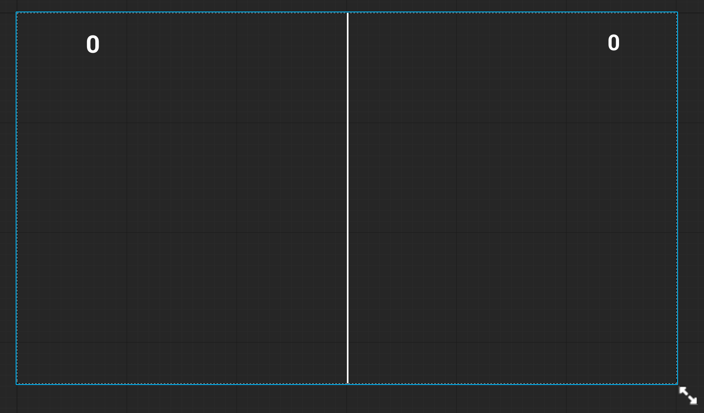

**Create Update Function:**
1. Switch to **Graph** tab (Button on the right side)

2. In **Functions**, create "UpdateScore"
3. Add two input parameters:
    - "P1Score" (Integer)
    - "P2Score" (Integer)
4. In the function:
    - Get reference to **Player1ScoreText**
    - Use **Set Text** and convert P1Score to Text (Int → Text node)
    - Do the same for Player2ScoreText

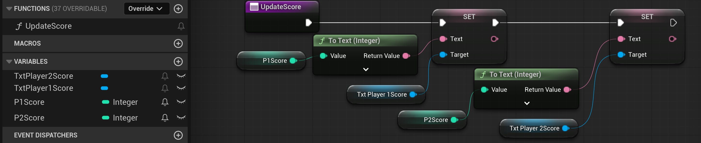

**Compile and Save**

### Display the HUD
1. Open **BP_PongGameMode**
2. Create a variable named UIRef. For the type, search for "pong" and select **WBP Pong UI** → **Object Reference**

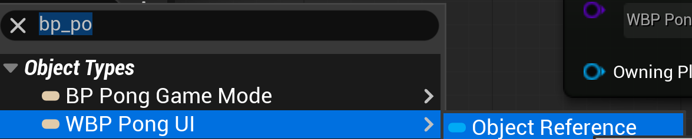

3. In **Event BeginPlay**:
    - Add **Create Widget** node
    - Set Class to **WBP_PongUI**
    - From the return value, set **UIRef**
    - Then from UIRef **Add to Viewport**

**Compile and Save**

Now when you play the game, you should see the UI displayed:

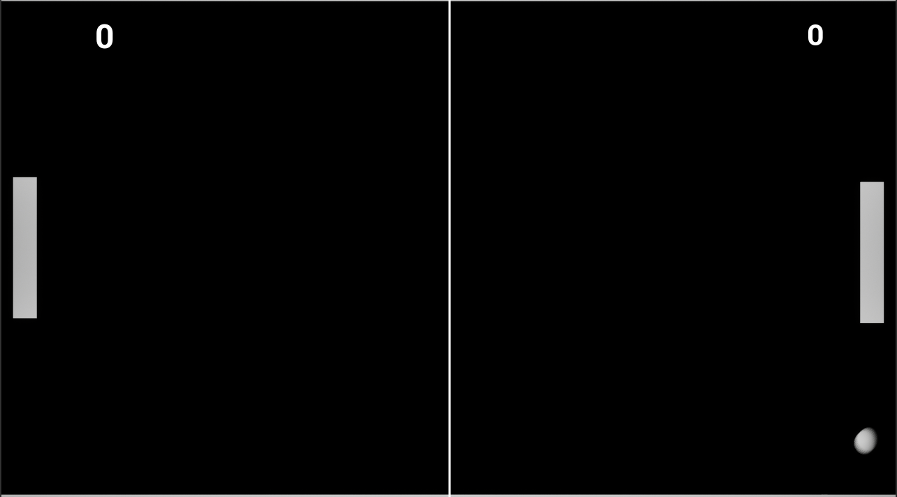

### Updating the UI Scores

For each AddPoint function in our game mode

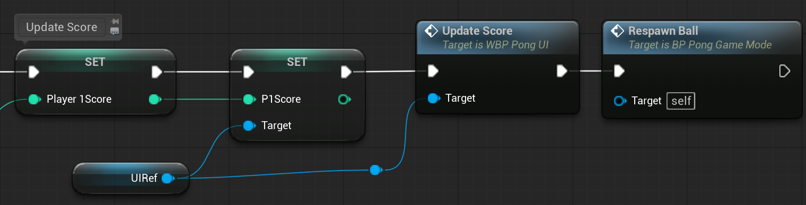

**Compile and Save**

If you run the game, you should see the UI scores update as expected:

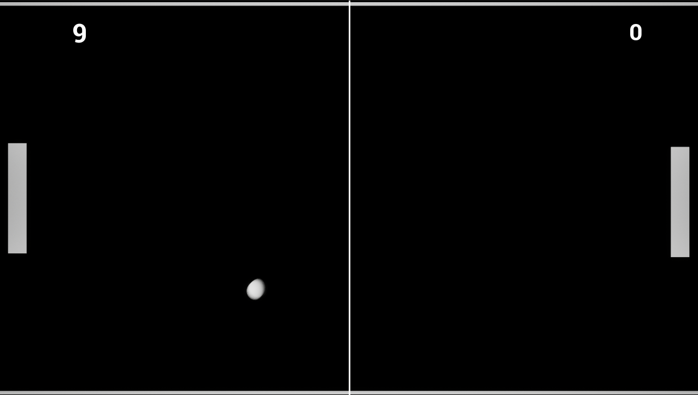

---
>Prev: [Score System](/08_Score/SCORE.md) |  Next: [Game Over Logic](/10_Over/OVER.md)