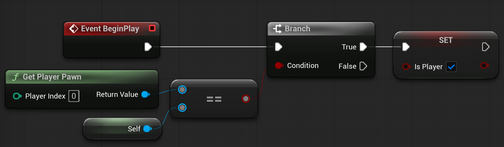
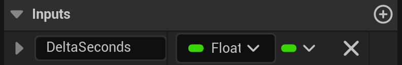
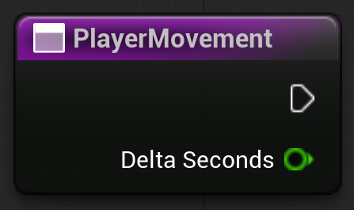
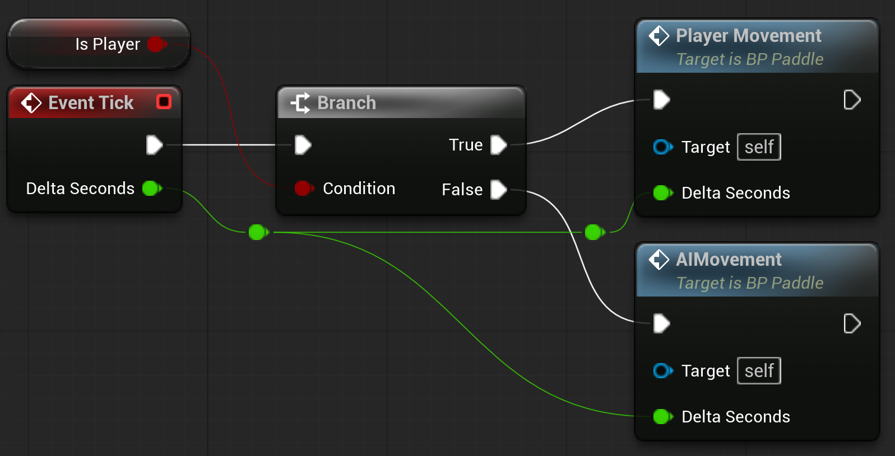
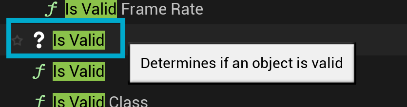
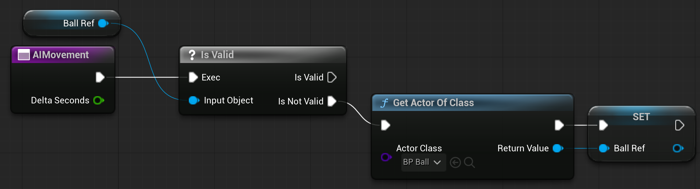
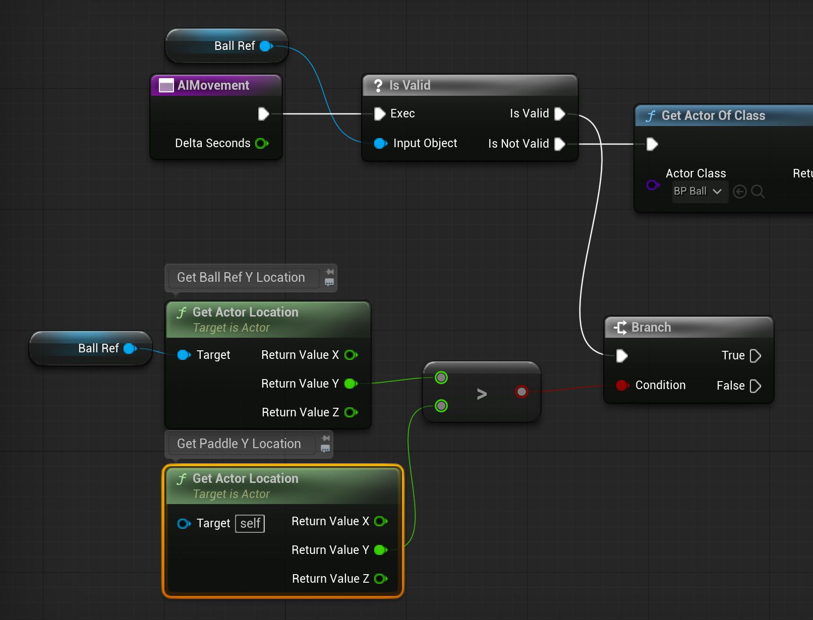
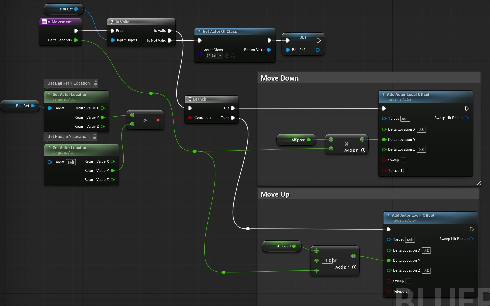

# Creating a Basic AI

Since we're using the same pawn class, BP_Paddle, for our player and AI, we need to check and store which one is the player.

## Checking for Player
1. In BP_Paddle, create a new boolean variable named **bIsPlayer**
2. In BeginPlay, we want to check if the Player's Pawn is this paddle.

## Movement Functions
To keep things from getting messy, I want to create two functions for handling movement (One for player input and the other for AI movement)

### PlayerMovement
1. Create a new function named PlayerMovement
2. Remember that we want our movement affected by DeltaSeconds, so that means we want to pass that value into our PlayerMovement function. To do that we need to add an Input parameter to the function.
3. Select PlayerMovement in the functions list. In the Details panel on the right-hand side, you'll see a section named Inputs. This works the same as when we've created variables before.
4. Click the '+' button and add a float variable named DeltaSeconds

Now you'll see that as a value that we can use just like with Event Tick

Now we want to move the player input logic from Tick to our new PlayerMovement function, and hook it up the same way

### AIMovement
1. Create a new function named AIMovement
2. Add an Input variable that's a float named DeltaSeconds
3. That's it for now

### Setting Up Tick
1. First, we need to tell the BluePrint to either listen for player input or be AI. We already know this from checking the player pawn in BeginPlay
2. We need to Branch based on bIsPlayer and call the appropriate function.
3. We also need to pass along DeltaSeconds from Tick into each function

## Paddle AI
When trying to create a virtual player, we need to think of the actions we want to replicate. Luckily Pong is pretty minimal. 

We're looking to replicate:
1. Moving Up
2. Moving Down
3. Trying to hit the ball so that it doesn't allow the player to score.

All of these actions are tied to the ball's location.

### Getting Reference to the Ball
1. First we want to create a new variable that will hold reference to the ball in the game.
   - Name the variable BallRef
   - For the variable type, search for BP_Ball and choose Object Reference
2. The first thing we want to do in our AIMovement function is to check and make sure that the Ball exists and we have reference to it. We can do this using an **Is Valid** node.
    - When searching for Is Valid, you'll see a few. You want the one that has a '?' beside it. It's usually near the bottom.
    - 
3. Then we make our variable for our ball reference the Input Object.
    - This works similarly to a Branch node and allows us to perform actions based on if our reference is valid or not
4. If it's not valid, we want to try and get the reference. We can do that by using the **Get Actor of Class** node.
5. Set the class to get to be BP_Ball.
6. Set BallRef to the return value.

### Moving the AI Paddle

If we have reference to the ball, we can now use it to move the paddle. We already know how to move the paddle because it moves just like the player moves, but instead of moving based on input, it will move based on the ball's Y location.

1. First, create a new float variable named AISpeed and set its default value to 500.
2. If the ball reference is valid, then we want to move the paddle up or down based on the ball's Y location.
    - We'll want a Branch node and a couple of **Get Actor Location** nodes
    - The condition will be if the ball's Y location is **greater than** (>) the paddle's Y location

3. Now like the player, we'll move the paddle using the **Add Actor Local Offset** node, along with AISpeed and DeltaSeconds.
    - If the Branch is True, the paddle should move down.
    - If False, it should move up.

Compile and Save

Now when you play the game, you should be able to control the left paddle based on input and the right paddle will move automatically based on the ball's position.

---
>Prev: [Creating the UI](/09_UI/UI.md) |  Next: [Game Over Logic](/11_Over/OVER.md)