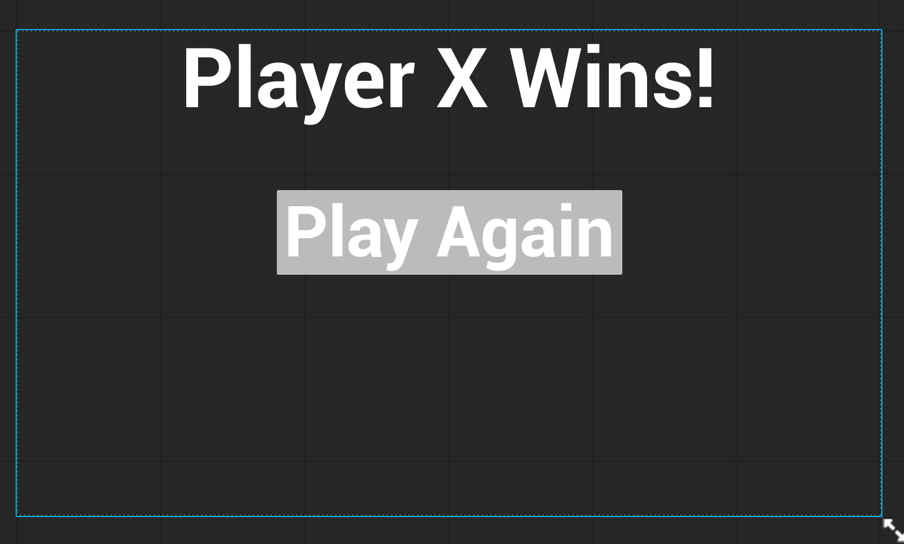
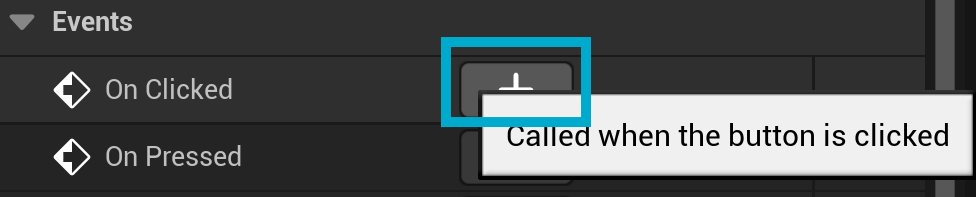
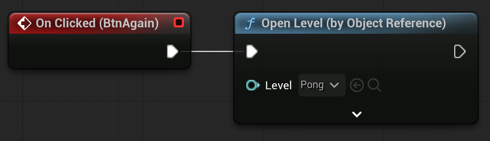
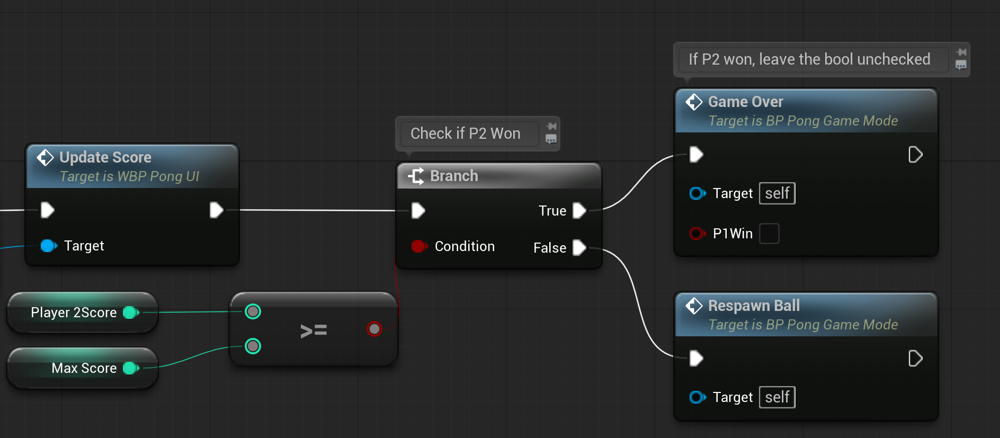
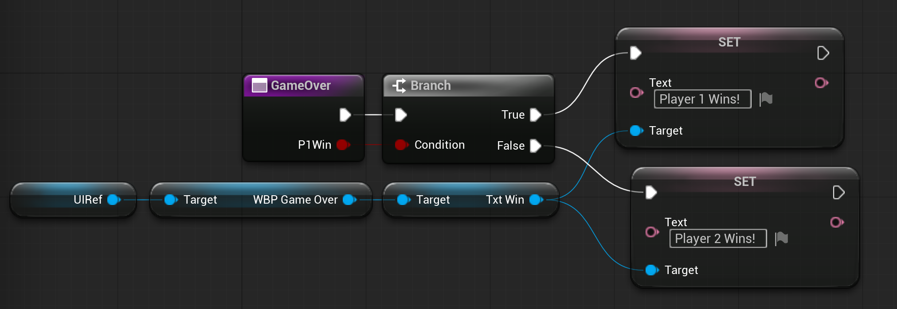
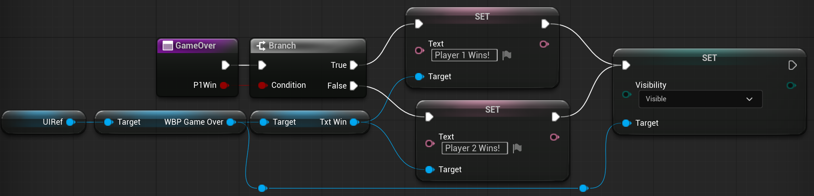
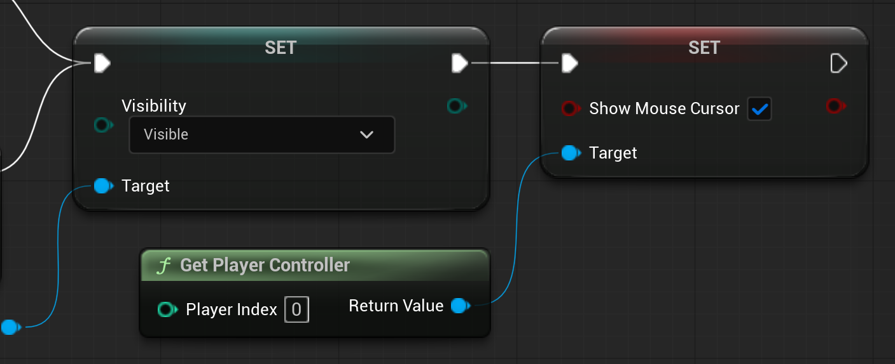

# Game Over Logic and UI
When the game is over, we want to present the player with the option to play again.

## Play Again UI
1. Create new Widget Blueprint named "WBP_GameOver" in the UMG folder
2. Add a Canvas Panel
3. Add a Text block
    - Make its name **TxtWin**, and check **Is Variable**
    - Make its anchor Top-Center
    - Make the X Alignment **0.5**
    - Check **Size To Content**
    - Make the default text: "Player X Wins!"
    - Make the font size 185
4. Add a button to the Canvas Panel
    - Name it **BtnAgain**, and check **Is Variable**
    - Make its anchor Top-Center
    - Make the X Alignment **0.5**
    - Check **Size To Content**
5. Add a Text block to the button (drag and drop it on top of the button in the Hierarchy in the bottom-left)
    - Set the default text to "Play Again"
    - Make the font size 155

## Play Again Button Logic
Now we need to make the button do something.
1. Select BtnAgain in the Hierarchy
2. Scroll to the bottom of the Details panel
3. Click the '+' button beside the **On Clicked** event.

4. Add and connect the Open Level (by Object Reference) node
5. Search and select the level Pong
6. Compile and Save

## Adding the New UI
1. Open WBP_PongUI
2. Search the palette for and add WBP_GameOver to the canvas panel
3. Select it and check **Is Variable**
4. Set the anchor to center
5. Make X and Y position 0
6. Set X and Y alignment to 0.5
7. Search for visibility (it's in the Behavior category) and set it to Hidden
    - This will make it so that we only see the screen when we call it
8. Compile and Save

## Check for a Win Condition
1. In **BP_PongGameMode**, create a new function called **GameOver**
2. Make GameOver have a boolean input named bP1Win
2. In both "AddPointPlayer" functions, respectively change:
    - After calling UpdateScore score, add a **Branch**
    - Check if player score >= MaxScore
    - If true, call **"GameOver"** custom event
        - For player one, check the boolean input
    - If false, RespawnBall

## GameOver
1. Create a Branch based on bP1Win
2. Get the UIRef. From that get WBP_GameOver. From that get TxtWin. From that search for Set Text.
3. If player 1 won, set the text to: Player 1 Wins!
4. If not, set it to: Player 2 Wins!

5. Either way, we want to show the screen by using the Set Visibility node for WBP_GameOver and making it Visible

6. Finally, we want to make sure the player can see their mouse cursor to click on the button.
    - To do that, we get the player controller
    - then set ShowMouseCursor to true

